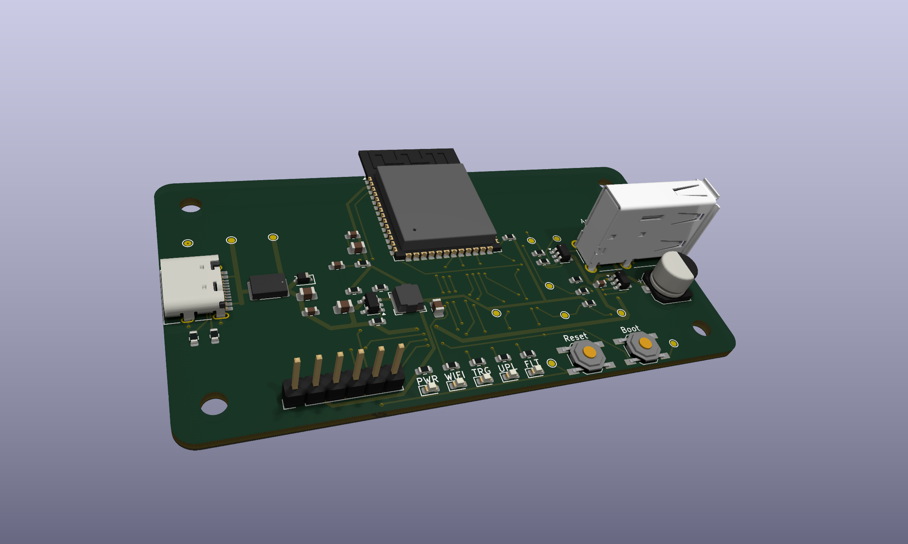
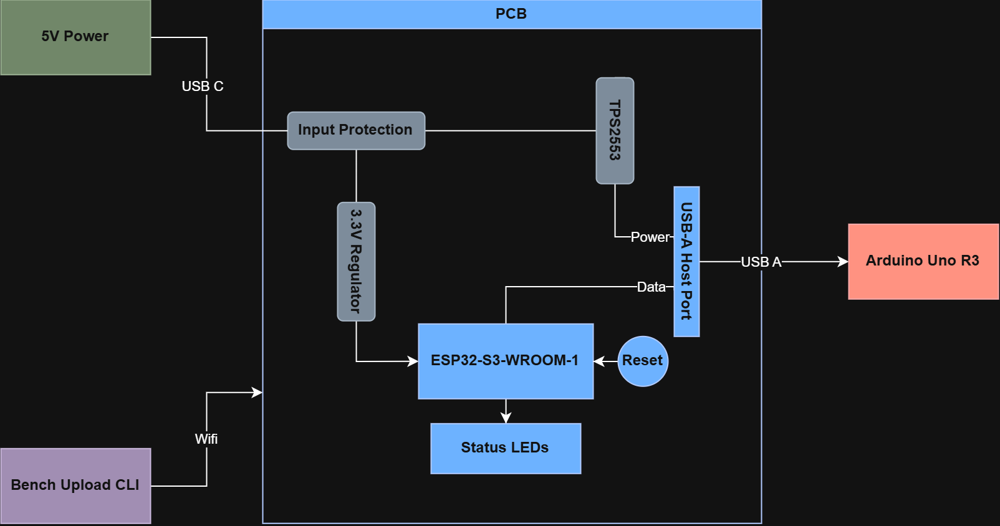
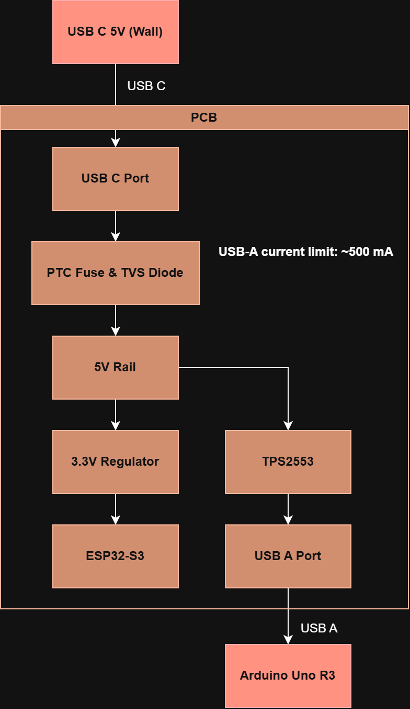
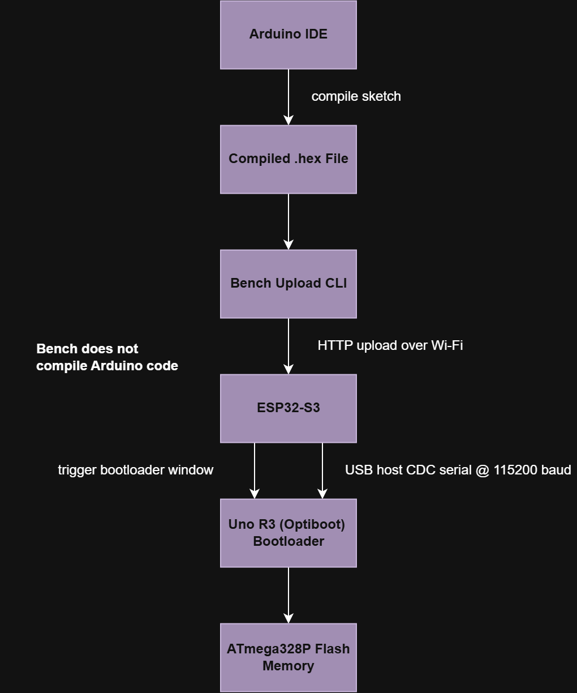

# Bench

<p align="center">
  
</p>


<p align="center">
  
  
  
  
</p>

<p align="center">
  🎥 YouTube video coming soon &nbsp;•&nbsp; 🌐 Project writeup coming soon
</p>

<p align="center">
  <a href="#project-goals">Project Goals</a> •
  <a href="#system-overview">System Overview</a> •
  <a href="#diagrams">Diagrams</a> •
  <a href="#hardware">Hardware</a> •
  <a href="#software">Software</a> •
  <a href="#license">License</a>
</p>

---

*Bench... and it's not made out of wood?*

Here's the pitch:

TLDR; wires are annoying, let's put Bench in the middle of the Arduino workflow.

I love Arduino, it's perfect for prototyping your projects before making your PCBs. 
But, idk about you, the most annoying thing to me is the fact that the board is tied to my laptop.
And it's not a graceful connection, no, these wires are some of the most stale twisted things you've ever used, especially the uni lab ones.
This gets even worse when you're using a desktop computer.
But what if we put a device in the middle?

Enter: Bench.

Bench is a wifi upload dock for Arduino (built primarily for the Uno R3 because it's the one I use most).
Compile your sketch, run a command, and boom, it uploads to your device somewhere else.
No more wire, Arduino dev becomes a little less life-draining.

This is a simple little project, but it's open source, and I hope you find some use out of it.
Feel free to leave issues, fork, or really do whatever you want with it.

## Project Goals

My goals for this project were to:
- Improve the Arduino dev experience
- Develop my hardware, firmware, and software design skills
- Document a project from beginning to end


## System Overview

Let's get into the details.

At a high level:

1. The laptop compiles an Arduino sketch into a `.hex` file.
2. The CLI sends the `.hex` file to Bench over Wi-Fi.
3. The ESP32-S3 on Bench receives the upload request.
4. Bench opens a USB host serial connection to the Arduino Uno R3.
5. Bench triggers the Uno bootloader window.
6. Bench uploads the program to the ATmega328P flash memory.

Bench does not compile Arduino code on-board; compilation happens on the laptop.

## Diagrams

### Labeled Board

<p align="center">
  
</p>

### System Block Diagram

<p align="center">
  
</p>

### Power Path

<p align="center">
  
</p>

### Upload/Data Flow

<p align="center">
  
</p>

## Repository Structure

```text
bench/
├── hardware/
│   ├── kicad/
│   └── exports/
├── software/
│   ├── mock/
│   │   └── bench-mock-server/
│   ├── cli/
│   │   └── bench-upload/
│   └── firmware/
│       └── bench-fw/
├── media/
│   ├── diagrams/
│   ├── renders/
│   └── screenshots/
├── LICENSE-SOFTWARE
├── LICENSE-HARDWARE
└── README.md
```

## Hardware

Bench is built around the ESP32-S3-WROOM-1.

Major hardware blocks include:

- USB-C 5V input
- Input protection using a PTC fuse and TVS diode
- 3.3V buck regulator for the ESP32-S3
- ESP32-S3-WROOM-1 Wi-Fi microcontroller
- USB-A host output for the Arduino Uno R3
- TPS2553 current-limited USB power switch
- USB data ESD protection
- Status LEDs for power, Wi-Fi, target, upload, and fault states
- Reset and boot/config buttons

## Software

Bench includes three software components:

```text
software/
├── mock/
│   └── bench-mock-server/
├── cli/
│   └── bench-upload/
└── firmware/
    └── bench-fw/
```

### Mock Server

The mock server simulates a Bench device on a local computer. It is used to test the CLI without Bench hardware.

```powershell
cd software\mock\bench-mock-server
python -m venv .venv
.venv\Scripts\Activate.ps1
python -m pip install --upgrade pip
python -m pip install -e .
bench-mock --port 8080
```

Test the mock server:

```text
http://127.0.0.1:8080/api/v1/status
```

### CLI

The Bench Upload CLI runs on the laptop, and can communicate with the firmware or mock server.

```powershell
cd software\cli\bench-upload
python -m venv .venv
.venv\Scripts\Activate.ps1
python -m pip install --upgrade pip
python -m pip install -e .
```

#### *Here's how to use the commands, demoed on the mock server...*

Check Bench status:

```powershell
bench status --device http://localhost:8080
```

Upload a precompiled Intel HEX file:

```powershell
bench upload --hex path\to\sketch.ino.hex --device http://localhost:8080
```

Upload without target reset:

```powershell
bench upload --hex path\to\sketch.ino.hex --no-reset --device http://localhost:8080
```

Upload without verify:

```powershell
bench upload --hex path\to\sketch.ino.hex --no-verify --device http://localhost:8080
```

Compile an Arduino sketch with Arduino CLI, then upload:

```powershell
bench upload path\to\Blink --fqbn arduino:avr:uno --device http://localhost:8080
```

### Firmware

The firmware is an ESP-IDF project for the ESP32-S3.

```powershell
cd software\firmware\bench-fw
idf.py set-target esp32s3
idf.py build
```

Wi-Fi settings are configured locally with:

```powershell
idf.py menuconfig
```

Then open:

```text
Bench Configuration
```

and set:

```text
Wi-Fi SSID
Wi-Fi password
```

## Firmware Features

Current firmware includes:

- Wi-Fi station startup
- HTTP API server
    - `GET /api/v1/status`
    - `POST /api/v1/target/power`
    - `POST /api/v1/target/reset`
    - `GET /api/v1/logs`
    - `POST /api/v1/upload`
    - `GET /api/v1/upload/{job_id}`
- ESP32-S3 USB host CDC
- Arduino Uno R3 Optiboot/STK500 upload path (🤞😩)
- GPIO control for TPS2553 target power
- GPIO control for status LEDs

The firmware builds successfully for ESP32-S3, but I haven't had the chance to test it on hardware, so be careful.

## API Overview

Bench firmware and the mock server expose the same main HTTP API shape.

```text
GET  /api/v1/status
POST /api/v1/upload
GET  /api/v1/upload/{job_id}
POST /api/v1/target/power
POST /api/v1/target/reset
GET  /api/v1/logs
```

Primary upload states:

```text
idle
receiving
opening_target
bootloader_sync
uploading
verifying
success
failed
fault
```

Primary error codes:

```text
INVALID_HEX
NO_TARGET
POWER_FAULT
USB_OPEN_FAILED
BOOTLOADER_TIMEOUT
UPLOAD_FAILED
VERIFY_FAILED
POWER_DISABLED
```

## Current Status

Bench Rev A is a complete prototype, but I haven't had the chance to fabricate it yet.

I'm confident in my hardware and software design, but the firmware, well, let's just say it was my first time programming an ESP32-S3... 😅

Something else pretty cool about this project is the documentation. I've created a video, a post on my website, this repo, and so much more, with full diagrams and explanations.
It's been part of my goal to build more in public, and this is one of the projects I'm most proud of so far. 
My chess board (ICB, 1/26-6/26) was awesome, but its docs were scattered. 
Bench is hopefully the start of a more cohesive online doc cycle, stay tuned for more.

In terms of future Bench additions, if there is a Rev B, expect:
- more in-depth CLI
- hardware redesign, maybe
- 3D printable exterior / mounts
- and more

## License

* **Software:** Licensed under the **[MIT License](LICENSE-SOFTWARE)**.
* **Hardware:** Schematics and PCB layouts are licensed under the **[CERN-OHL-P-2.0](LICENSE-HARDWARE)** (CERN Open Hardware Licence Version 2 - Permissive).
* **Media & Documentation:** Renders, diagrams, and written assets are **© 2026 Amir Vered** unless otherwise stated. All rights reserved.